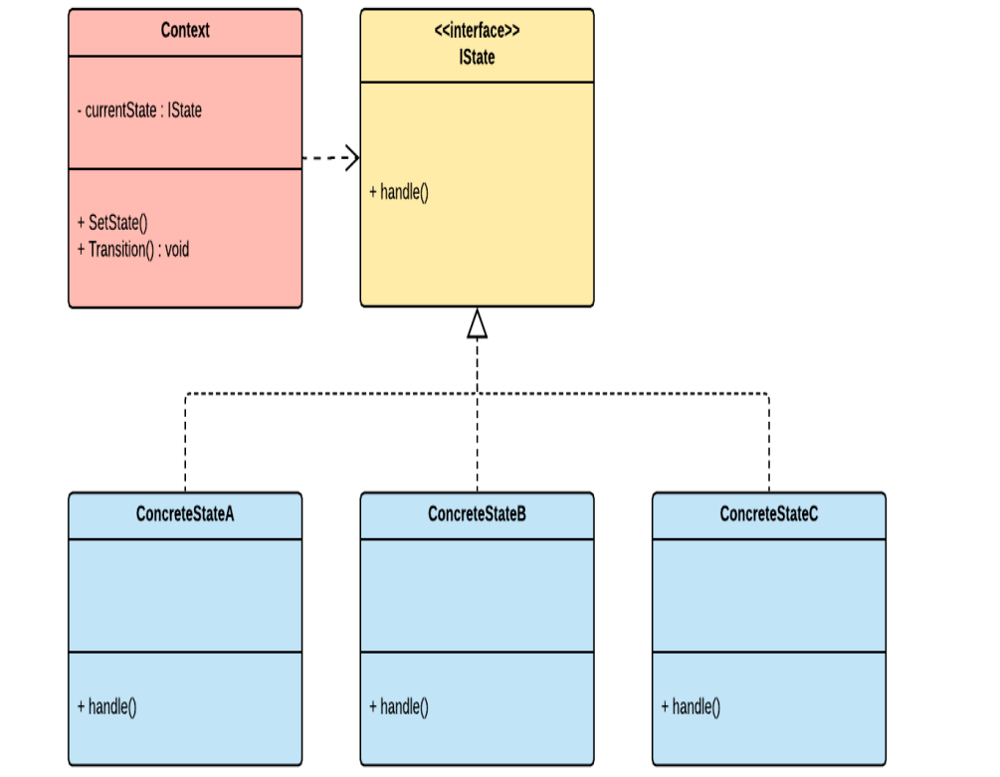
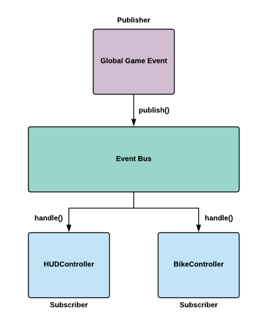

# Singleton
* Ý tưởng: Bất kỳ lớp nào triển khai singleton đều sẽ chỉ có duy nhất một phiên bản tồn tại trong suốt thời gian chạy trò chơi
* Sơ đồ minh hoạ cho Singleton: 
* Ưu điểm
    - Có thể truy cập toàn cầu: Chúng ta có thể sử dụng mẫu Singleton để tạo điểm truy cập toàn cầu vào các tài nguyên hoặc dịch vụ
    - Kiểm soát đồng thời: Mẫu này có thể được sử dụng để hạn chế quyền truy cập đồng thời vào các tài nguyên được chia sẻ.
* Nhược điểm:
    - Khó khăn trong việc kiểm thử đơn vị
    - Vì dễ tiếp cận nên nó có thể ảnh hưởng đến thói quen lập trình.
# State Pattern
* Ý tưởng: Mẫu thiết kế này được dùng để giải quyết vấn đề xử lý các trạng thái riêng lẻ của vật thể. Vì trong khi trò chơi đang chạy sẽ có nhiều thực thể trong trò chơi có thể chuyển đổi nhiều hành động khác nhau nên việc vật cần một mẫu để có thể quản lý những hành dộng này là cần thiết.
* Sơ đồ minh hoạ cho State Pattern: 
* Ưu điểm
    - Đóng gói: Mẫu Trạng thái cho phép chúng ta triển khai các hành vi trạng thái của một thực thể dưới dạng tập hợp các thành phần có thể được gán động cho một đối tượng khi nó thay đổi trạng thái.
    - Bảo trì: Chúng ta có thể dễ dàng triển khai các trạng thái mới mà không cần phải sửa đổi các câu lệnh điều kiện dài dòng hoặc các lớp cồng kềnh.
* Nhược điểm:
    - Trộn: Ở dạng nguyên bản, mẫu Trạng thái không cung cấp giải pháp trộn hoạt ảnh. Hạn chế này có thể trở thành vấn đề khi bạn muốn đạt được sự chuyển đổi hình ảnh mượt mà giữa các trạng thái hoạt hình của nhân vật.
    - Chuyển đổi: Khi triển khai mẫu, chúng ta có thể dễ dàng chuyển đổi giữa các trạng thái, nhưng chúng ta không xác định mối quan hệ giữa chúng. Do đó, nếu chúng ta muốn xác định sự chuyển đổi giữa các trạng thái dựa trên các mối quan hệ và điều kiện, chúng ta sẽ phải viết nhiều mã hơn; chẳng hạn, nếu tôi muốn trạng thái không hoạt động chuyển sang trạng thái đi bộ và sau đó trạng thái đi bộ chuyển sang trạng thái chạy. Và điều này diễn ra một cách tự động và trơn tru, qua lại, tùy thuộc vào yếu tố kích hoạt hoặc điều kiện. Điều này có thể tốn thời gian để thực hiện trong mã.
# Event Bus Pattern
* Ý tưởng: Mẫu thiết kế này được dùng để quản lý các sự kiện trong trò chơi. Khi một sự kiện được một đối tượng(Người xuất bản) đưa ra, nó sẽ gửi tín hiệu cho các đối tượng(Người đăng ký).
* Sơ đồ minh hoạ cho Event Bus Pattern: 
* Ưu điểm:
    - Tách rời(Decoupling): Lợi ích chính của việc sử dụng Event Bus là nó tách rời các đối tượng trong hệ thống ra. Các đối tượng có thể giao tiếp thông qua các sự kiện thay vì tham chiếu trực tiếp lẫn nhau.
    - Tính đơn giản(Simplicity): Event Bus mang đến sự đơn gian bằng cách trừu tượng hoá cơ chế xuất bản hoặc đăng kí sự kiện từ client của nó.
* Nhược điểm:
    - Hiệu suất(Performance): Dưới bất kỳ một Event system nào cũng tồn tại một cơ chế quan lý cấp thấp quản lý việc gửi tin giữa các đối tượng trong hệ thông. Do đó, có thể sẽ phát sinh ra một chút chi phí hiệu suất khi sử dụng Event Bus. Nhưng tuỳ thuộc vào mục đích sử dụng chi phí này có thể rất nhỏ
    - Tính toàn cầu(Global): Gây khó khăn trong việc gỡ lỗi và kiểm thử đơn vị.
