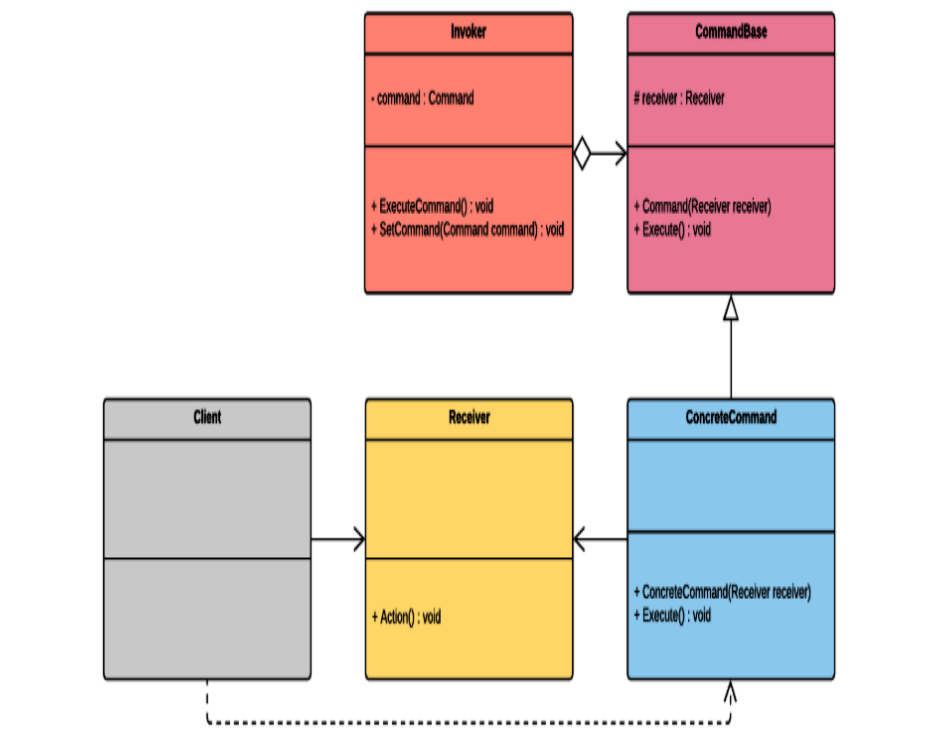

# Singleton
* Ý tưởng: Bất kỳ lớp nào triển khai singleton đều sẽ chỉ có duy nhất một phiên bản tồn tại trong suốt thời gian chạy trò chơi
* Sơ đồ minh hoạ cho Singleton: 
* Ưu điểm
    - Có thể truy cập toàn cầu: Chúng ta có thể sử dụng mẫu Singleton để tạo điểm truy cập toàn cầu vào các tài nguyên hoặc dịch vụ
    - Kiểm soát đồng thời: Mẫu này có thể được sử dụng để hạn chế quyền truy cập đồng thời vào các tài nguyên được chia sẻ.
* Nhược điểm:
    - Khó khăn trong việc kiểm thử đơn vị
    - Vì dễ tiếp cận nên nó có thể ảnh hưởng đến thói quen lập trình.
# State Pattern
* Ý tưởng: Mẫu thiết kế này được dùng để giải quyết vấn đề xử lý các trạng thái riêng lẻ của vật thể. Vì trong khi trò chơi đang chạy sẽ có nhiều thực thể trong trò chơi có thể chuyển đổi nhiều hành động khác nhau nên việc vật cần một mẫu để có thể quản lý những hành dộng này là cần thiết.
* Sơ đồ minh hoạ cho State Pattern: 
* Ưu điểm
    - Đóng gói: Mẫu Trạng thái cho phép chúng ta triển khai các hành vi trạng thái của một thực thể dưới dạng tập hợp các thành phần có thể được gán động cho một đối tượng khi nó thay đổi trạng thái.
    - Bảo trì: Chúng ta có thể dễ dàng triển khai các trạng thái mới mà không cần phải sửa đổi các câu lệnh điều kiện dài dòng hoặc các lớp cồng kềnh.
* Nhược điểm:
    - Trộn: Ở dạng nguyên bản, mẫu Trạng thái không cung cấp giải pháp trộn hoạt ảnh. Hạn chế này có thể trở thành vấn đề khi bạn muốn đạt được sự chuyển đổi hình ảnh mượt mà giữa các trạng thái hoạt hình của nhân vật.
    - Chuyển đổi: Khi triển khai mẫu, chúng ta có thể dễ dàng chuyển đổi giữa các trạng thái, nhưng chúng ta không xác định mối quan hệ giữa chúng. Do đó, nếu chúng ta muốn xác định sự chuyển đổi giữa các trạng thái dựa trên các mối quan hệ và điều kiện, chúng ta sẽ phải viết nhiều mã hơn; chẳng hạn, nếu tôi muốn trạng thái không hoạt động chuyển sang trạng thái đi bộ và sau đó trạng thái đi bộ chuyển sang trạng thái chạy. Và điều này diễn ra một cách tự động và trơn tru, qua lại, tùy thuộc vào yếu tố kích hoạt hoặc điều kiện. Điều này có thể tốn thời gian để thực hiện trong mã.
# Event Bus Pattern
* Ý tưởng: Mẫu thiết kế này được dùng để quản lý các sự kiện trong trò chơi. Khi một sự kiện được một đối tượng(Người xuất bản) đưa ra, nó sẽ gửi tín hiệu cho các đối tượng(Người đăng ký).
* Sơ đồ minh hoạ cho Event Bus Pattern: 
* Ưu điểm:
    - Tách rời(Decoupling): Lợi ích chính của việc sử dụng Event Bus là nó tách rời các đối tượng trong hệ thống ra. Các đối tượng có thể giao tiếp thông qua các sự kiện thay vì tham chiếu trực tiếp lẫn nhau.
    - Tính đơn giản(Simplicity): Event Bus mang đến sự đơn gian bằng cách trừu tượng hoá cơ chế xuất bản hoặc đăng kí sự kiện từ client của nó.
* Nhược điểm:
    - Hiệu suất(Performance): Dưới bất kỳ một Event system nào cũng tồn tại một cơ chế quan lý cấp thấp quản lý việc gửi tin giữa các đối tượng trong hệ thông. Do đó, có thể sẽ phát sinh ra một chút chi phí hiệu suất khi sử dụng Event Bus. Nhưng tuỳ thuộc vào mục đích sử dụng chi phí này có thể rất nhỏ
    - Tính toàn cầu(Global): Gây khó khăn trong việc gỡ lỗi và kiểm thử đơn vị.
# Command Pattern(make replay system)
* Ý tưởng: Trong một trò chơi khi thực hiện hành động cho một nhân vật nhảy lên thì nếu người chơi muốn lặp lại động tác đó mà không cần thực hiện lại thao tác chỉ mà máy tính sẽ thực hiện lại hành động nhảy của nhân vật được ghi lại từ thao tác trước đó của người chơi. Để làm được điều đó ta sử dụng Command Pattern để tách đối tượng gọi thao tác và đối tượng thực hiên thao tác.
* Sơ đồ minh hoạ Command Pattern: 
* Dựa vào sơ đồ mình hoạ ta có được sơ đồ mình hoạ của hệ thông replay system: 
* Ưu điểm: 
    * Tách rời(Decoupling): Mẫu cho phép tác đối tượng gọi khỏi đối tượng thực thi lệnh. Lớp phân tách này cho phép bổ sung một trung gian có khả năng lưu lại các hoạt động và thực hiện chúng theo trình tự.
    * Tính trình tự(Sequencing): Tạo điều kiện thuận lợi cho quá trình sắp xếp đầu vào của người dùng, cho phép thực hiện các tính năng hoàn tác/làm lại, marco và hàng đợi lệnh.
* Nhược điểm:
    * Độ phức tạp(Complexity): Để triển khai mẫu này cần có nhiều lớp để thực hiện. Và các lớp được xây dựng liên kết với nhau khá phức tạp.
# Object Pooling Pattern
* Ý tưởng: Tạo một nhóm các đối tượng đã được lưu trữ sẵn ở trong một vùng nhớ cố định. Người dùng có thể gọi nhóm đối tượng này khi cần đến và chúng sẽ được tạo mới nếu chưa tồn tại bên trong bộ nhớ nếu đã có thì chúng sẽ được gọi ra, khi đã được sử dụng xong thì chúng sẽ quay lại hàng đợi và bị ẩn đi để chờ đợi lần gọi ra tiếp theo. Nếu như số lượng các đối tượng vượt quá các kích cỡ của vùng nhớ thì chương trình sẽ giải phóng các đối tượng thừa.
* Hình ảnh minh hoạ mẫu Object Pooling: 
* Ưu điểm: 
    * Mức sử dụng bộ nhớ có thể dự đoán được: Chúng ta có thể phân bổ theo cách có thể dự đoạn được một số nội dung được lưu trong bộ nhớ cụ thể.
    * Tăng hiệu xuất: Bằng cách khởi tạo đối tượng đã được lưu sẵn trong bộ nhớ, ta tránh được chi phí phải trả khi khởi tạo các đối tượng mới.
* Nhược điểm: 
    * Phân lớp trên bộ nhớ đã được quản lý bởi ngôn ngữ C#: Với ngôn ngữ hiện đại như C# thì nhiều người cho rằng mẫu này không thực sự cần thiết. Điều này có thể đúng ở một số bối cảnh những cũng có thể sai ở một số bối cảnh khác.
    * Các trạng thái của đối tượng có thể không đoán trước được: Nếu mẫu này được sử dụng không chính xác thì các đối tượng khi được đưa trở lại hàng đợi khi đang ở trạng thái hiện tại mà không phải trạng thái ban đầu. Ví dụ: Khi môt enemy bị tiêu diệt và quay trở lại hàng đợi để chờ cho lần sử dụng tiếp theo nhưng máu của enemy vẫn giữ ở mức bị tiêu diệt.
# Observer Pattern
* Ý tưởng: Dùng để tạo ra mối quan hệ một nhiều giữa thành phần chủ thể và người theo dõi chủ thể. Khi có gì thay đổi bên trong chủ thể thì nó sẽ thông báo đến cho những lớp đang theo dõi chủ thể đó. Mẫu này gần giống với Event Bus những điều khác biết là các đối tượng trong Observer Pattern có thể nhận diện ra nhau.
* Sơ đồ minh hoạ Observer Pattern: 
* Ưu điểm: 
    * Tính linh động(Dynamism): Các đối tượng chủ thể có thể cho thêm bao nhiều người quan sát tuỳ ý muốn.
    * Thể hiện được mối quan hệ một nhiều: Mẫu này cho phép thể hiện được rõ ràng các quan hệ một nhiều giữa các đối tượng bên trong hệ thống.
* Nhược điểm:
    * Lộn xộn(Disorder): Mẫu này không đảm bảo thức tự người quan sát nhận được thông báo. Vì vậy nếu trong hệ thống có hai đối tượng cùng liên kết đến mốt thành phần bên trong chủ thể và phải thực hiện tuần tự thì nguyên bản của mẫu này không đáp ứng được.
    * Rò rỉ thông tin(Leaking): Có thể dẫn đến rò rỉ bộ nhớ nếu chủ thể giữ các liên kết mạnh đến người quan sát. Nếu nó được triển khai không chính xác và các đối tượng không được tách rời và xử lý đúng cách thì điều này có thể gây cản trở trong qua trình dọn dẹp bộ nhớ và không được giải phóng.
# Visitor Pattern
* Ý tưởng: Một đối tượng có thể cho khách phép truy cập các thành phần cụ thể của nó thông qua các lớp dùng để nhận diện hành vi truy cập đó.
* Sơ đồ minh hoạ cho Visitor Pattern: 
* Ưu điểm: 
    * Tính mở/đóng(Open/Close): Sử dụng mẫu này giúp ta tuân thủ được nguyên tắc O(Open/Close) trong SOLID trong đó mô tả các đối tượng có thể mở rộng thì sẽ mở còn những đối tượng không cần mở rộng thì có thể dễ dàng sửa đổi.
    * Trách nhiệm duy nhất(Single Responsible): Mẫu này cũng tuân thủ theo nguyên tắc S trong SOLID trong đó mẫu này mô tả việc các Visitor và các Visitable có thể đưa ra các hành vi cụ thể độc quyền của nó
* Nhược điểm: 
    * Khả năng truy cập(Accessibility): Việc xây dựng mẫu này có thể thiếu các quyền truy cập vào các quyền riêng tư cụ thể.
    * Độ phức tạp(Complexity): Mẫu này là một mẫu phức tạp vì khi xây dựng ta sẽ cần tách ra thành nhiều class để xây dựng mỗi class sẽ đảm nhiệm một chức năng riêng biệt điều này có thể khiến cho những lập trình viên chưa quen với mẫu này khó đọc mã
